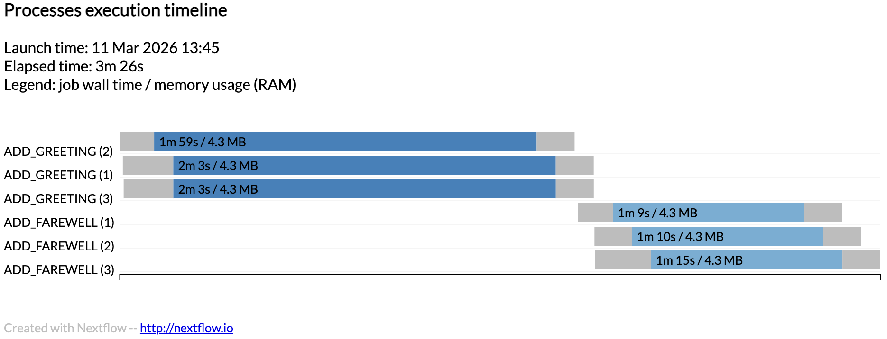

# nextflow-lsf-tiny
Tiny test of nextflow + LSF

Reuse St Jude executor config: https://nf-co.re/configs/stjude/

**Local Run**

```bash
nextflow run main.nf \
  --infiles "data/*.txt" \
  -with-timeline timeline.html
```

Which prints out:

```bash

 N E X T F L O W   ~  version 25.10.4

Launching `main.nf` [berserk_snyder] DSL2 - revision: fefaf60a91

executor >  local (6)
[4b/e68756] ADD_GREETING (1) [100%] 3 of 3 ✔
[33/8d96f7] ADD_FAREWELL (3) [100%] 3 of 3 ✔
/Users/jchang99/github/j23414/nextflow-lsf-tiny/work/5a/9dbdfba1fd007483db24b43b3ee9e1/bob_greeting_letter.txt
/Users/jchang99/github/j23414/nextflow-lsf-tiny/work/15/07950d05821bdca2e3e6937b968ff1/charlie_greeting_letter.txt
/Users/jchang99/github/j23414/nextflow-lsf-tiny/work/33/8d96f76ff693ea486760bf1820af0b/alice_greeting_letter.txt

Completed at: 11-Mar-2026 11:20:17
Duration    : 2m 31s
CPU hours   : 0.1
Succeeded   : 6
```

**timeline.html**


**Pull from GitHub and Run**

```bash
mkdir data
echo "alice" > data/alice.txt
echo "bob" > data/bob.txt
echo "charlie" > data/charlie.txt

nextflow run j23414/nextflow-lsf-tiny \
  -r main \
  --infiles "data/*.txt" \
  -with-timeline timeline.html
```

**LSF HPC Run**

```bash
nextflow run main.nf \
  --infiles "data/*.txt" \
  -with-timeline timeline_hpc.html \
  -config stjude.config
```

Or submit to LSF with

```bash
bsub < submit_job.lsf
```

**timeline_hpc.html**

